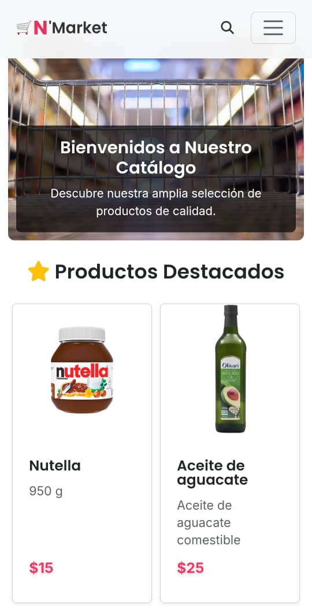

# 🛍️ CatalogoWeb

[](https://djangoproject.com/)
[](https://python.org/)
[](https://getbootstrap.com/)
[](LICENSE)

A modern and responsive product catalog system developed with Django, allowing you to manage and display products organized by categories with an intuitive interface and advanced search functionality.

## ✨ Features

- 🏠 **Homepage** with featured products and category navigation
- 📦 **Product management** with images, descriptions, and prices
- 🏷️ **Category system** to organize products
- 🔍 **Advanced search** by name and description
- 📱 **Responsive design** with Bootstrap 5
- 🖼️ **Image management** with Pillow
- ⚡ **REST API** for integration with other systems
- 🛠️ **Custom admin panel**
- 🗄️ **Multi-database support** (SQLite local, MySQL in production)

## 🚀 Technologies Used

- **Backend**: Django 5.2.4
- **Frontend**: Bootstrap 5, HTML5, CSS3
- **Database**: SQLite (development) / MySQL (production)
- **Image processing**: Pillow
- **Deployment**: PythonAnywhere

## 📋 Prerequisites

- Python 3.8 or higher
- pip (Python package manager)
- MySQL (optional, for production)

## 🛠️ Installation

### 1. Clone the repository

```bash
git clone https://github.com/your-username/CatalogoWeb.git
cd CatalogoWeb
```

### 2. Create a virtual environment

```bash
python -m venv venv

# On Windows
venv\Scripts\activate

# On Linux/Mac
source venv/bin/activate
```

### 3. Install dependencies

```bash
pip install -r requirements.txt
```

### 4. Configure the database

```bash
python manage.py makemigrations
python manage.py migrate
```

### 5. Create a superuser (optional)

```bash
python manage.py createsuperuser
```

### 6. Load sample data (optional)

```bash
python manage.py loaddata categorias.json
python manage.py loaddata productos.json
```

### 7. Run the development server

```bash
python manage.py runserver
```

The site will be available at `http://127.0.0.1:8000/`

## 📁 Project Structure

```
CatalogoWeb/
├── Catalogo/                 # Django project configuration
│   ├── settings.py          # Main settings
│   ├── urls.py              # Main URLs
│   └── wsgi.py              # WSGI configuration
├── CatalogoWeb/             # Main application
│   ├── models.py            # Data models (Product, Category)
│   ├── views.py             # Views and business logic
│   ├── urls.py              # Application URLs
│   ├── admin.py             # Admin configuration
│   ├── templates/           # HTML templates
│   ├── static/              # Static files (CSS, JS, images)
│   └── migrations/          # Database migrations
├── media/                   # User uploaded files
├── staticfiles/             # Collected static files
├── requirements.txt         # Project dependencies
└── manage.py               # Django management script
```

## 🎯 Main Features

### Homepage
- Shows the latest 6 products as featured
- Category navigation
- Attractive design with image carousel

### Product Management
- **Product listing** with category filters
- **Product details** with complete information
- **Search** by name and description
- **Related products** by category

### Category System
- Hierarchical product organization
- Category navigation
- Dynamic filtering

### REST API
- `/api/productos/` endpoint to get products in JSON format
- Ideal for integration with mobile apps or separate frontend

## 🔧 Configuration

### Environment Variables

The project automatically detects the environment:

- **Local development**: Uses SQLite and DEBUG mode
- **Production (PythonAnywhere)**: Uses MySQL and secure mode

### Customization

You can modify the following configurations in `Catalogo/settings.py`:

- `ALLOWED_HOSTS`: Allowed domains
- `DATABASES`: Database configuration
- `STATIC_URL` and `MEDIA_URL`: URLs for static and media files

## 📱 Screenshots

### Homepage

*Main page showing featured products and category navigation*

### Product Listing

*Complete product catalog with search and filter options*

### Product Details

*Detailed product view with related products*

### Search Results

*Search functionality with filtered results*

### Category View

*Products organized by categories*

### Admin Panel

*Custom administration dashboard*

## 🚀 Deployment

### PythonAnywhere

1. Upload your code to PythonAnywhere
2. Configure MySQL database
3. Run migrations
4. Configure static files
5. The site will be available on your domain

### Other providers

The project is compatible with any Django-supporting provider:
- Heroku
- DigitalOcean
- AWS
- Google Cloud Platform

## 🤝 Contributing

Contributions are welcome. To contribute:

1. Fork the project
2. Create a feature branch (`git checkout -b feature/AmazingFeature`)
3. Commit your changes (`git commit -m 'Add some AmazingFeature'`)
4. Push to the branch (`git push origin feature/AmazingFeature`)
5. Open a Pull Request

## 📝 License

This project is under the MIT License. See the `LICENSE` file for more details.

## 👨‍💻 Author

**Your Name**
- GitHub: [@your-username](https://github.com/your-username)
- Email: your-email@example.com

## 🙏 Acknowledgments

- [Django](https://djangoproject.com/) - Web framework
- [Bootstrap](https://getbootstrap.com/) - CSS framework
- [PythonAnywhere](https://www.pythonanywhere.com/) - Hosting

## 📞 Support

If you have any questions or need help, feel free to:

- Open an [issue](https://github.com/your-username/CatalogoWeb/issues)
- Contact me by email
- Check the [Django documentation](https://docs.djangoproject.com/)

---

⭐ Don't forget to give the project a star if you find it useful!
